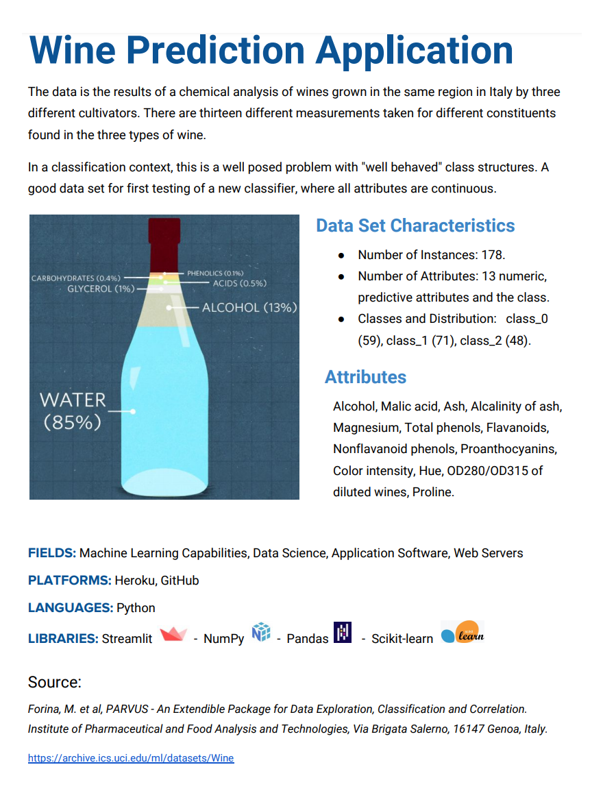

### `sklearn.ensemble.RandomForestClassifier`
A random forest is a meta estimator that fits a number of decision tree classifiers on various sub-samples of the dataset and uses averaging to improve the predictive accuracy and control over-fitting. < \b> The sub-sample size can be controlled with the max_samples parameter if bootstrap=True (default).

### Source:
*Forina, M. et al, PARVUS - An Extendible Package for Data Exploration, Classification and Correlation.
Institute of Pharmaceutical and Food Analysis and Technologies, Via Brigata Salerno, 16147 Genoa, Italy.*

https://archive.ics.uci.edu/ml/datasets/Wine
